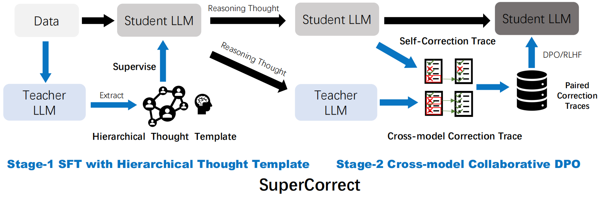
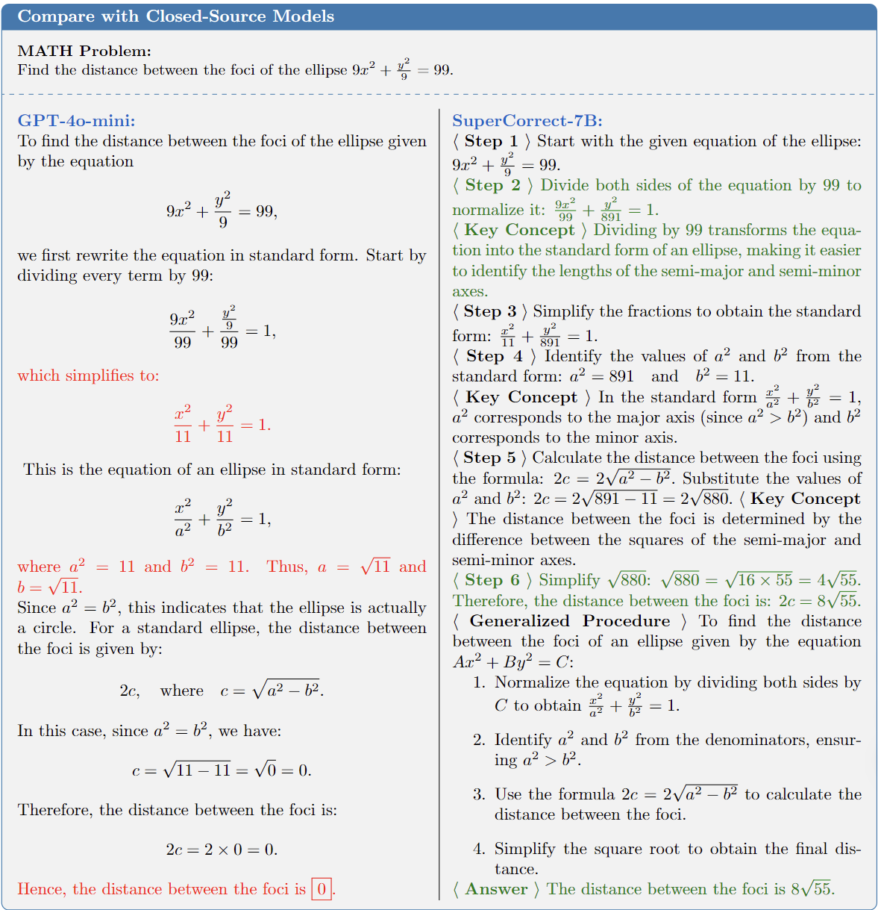
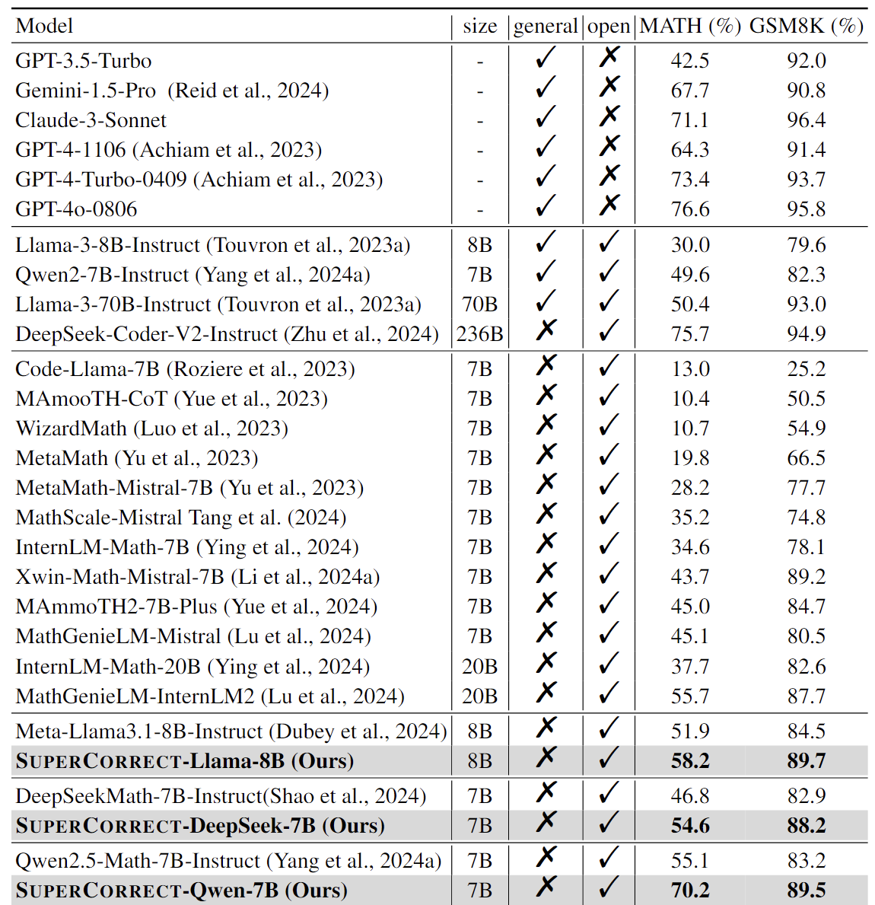

## SuperCorrect: Supervising and Correcting Language Models with Error-Driven Insights

> [**SuperCorrect: Supervising and Correcting Language Models with Error-Driven Insights**](https://arxiv.org/abs/2410.09008)  
> [Ling Yang\*](https://yangling0818.github.io/), [Zhaochen Yu*](https://github.com/BitCodingWalkin), [Tianjun Zhang](https://tianjunz.github.io/), [Minkai Xu](https://minkaixu.com/), [Joseph E. Gonzalez](https://people.eecs.berkeley.edu/~jegonzal/),[Bin Cui](https://cuibinpku.github.io/), [Shuicheng Yan](https://yanshuicheng.info/)  
> Peking University, Skywork AI, UC Berkeley, Stanford University 

<p align="left">
  <a href='https://arxiv.org/abs/2410.09008'>
  </a> 
  <a href='https://huggingface.co/BitStarWalkin/SuperCorrect-7B'>
  </a>
  </p>

## Introduction



This repo provides the official implementation of SuperCorrect,  a novel two-stage fine-tuning method for improving both reasoning accuracy and self-correction ability for LLMs. Notably, our **SupperCorrect-7B** model significantly surpasses powerful **DeepSeekMath-7B by 7.8%/5.3% and Qwen2.5-Math-7B by 15.1%/6.3% on MATH/GSM8K benchmarks**, achieving new SOTA performance among all 7B models.


🚨 Unlike other LLMs, we incorporate LLMs with our pre-defined hierarchical thought template ([Buffer of Thought (BoT)](https://github.com/YangLing0818/buffer-of-thought-llm)) to conduct more deliberate reasoning than conventional CoT. It should be noted that our evaluation methods relies on pure mathematical reasoning abilities of LLMs, instead of leverage other programming methods such as PoT and ToRA.


## Examples



<div align="left">
<b>
🚨 For more concise and clear presentation, we omit some XML tags  
</b>
</div>

## Quick Start

### Installation

```bash
git clone https://github.com/YangLing0818/SuperCorrect
cd SuperCorrect
conda create -n SuperCorrect python==3.10
conda activate SuperCorrect
pip install -r requirements.txt
```

### Requirements

* Since our current model is  based on Qwen2.5-Math series, `transformers>=4.37.0` is needed for Qwen2.5-Math models. The latest version is recommended.

> [!Warning]
>
> <div align="center">
> <b>
> 🚨 This is a must because `transformers` integrated Qwen2 codes since `4.37.0`.
> </b>
> </div>

### Inference with Different Library

#### 🤗 Hugging Face Transformers

```python
from transformers import AutoModelForCausalLM, AutoTokenizer

model_name = "BitStarWalkin/SuperCorrect-7B"
device = "cuda" 

model = AutoModelForCausalLM.from_pretrained(
    model_name,
    torch_dtype="auto",
    device_map="auto"
)
tokenizer = AutoTokenizer.from_pretrained(model_name)

prompt = "Find the distance between the foci of the ellipse \[9x^2 + \frac{y^2}{9} = 99.\]"
hierarchical_prompt = "Solve the following math problem in a step-by-step XML format, each step should be enclosed within tags like <Step1></Step1>. For each step enclosed within the tags, determine if this step is challenging and tricky, if so, add detailed explanation and analysis enclosed within <Key> </Key> in this step, as helpful annotations to help you thinking and remind yourself how to conduct reasoning correctly. After all the reasoning steps, summarize the common solution and reasoning steps to help you and your classmates who are not good at math generalize to similar problems within <Generalized></Generalized>. Finally present the final answer within <Answer> </Answer>."
# HT
messages = [
    {"role": "system", "content":hierarchical_prompt },
    {"role": "user", "content": prompt}
]

text = tokenizer.apply_chat_template(
    messages,
    tokenize=False,
    add_generation_prompt=True
)
model_inputs = tokenizer([text], return_tensors="pt").to(device)

generated_ids = model.generate(
    **model_inputs,
    max_new_tokens=1024
)
generated_ids = [
    output_ids[len(input_ids):] for input_ids, output_ids in zip(model_inputs.input_ids, generated_ids)
]

response = tokenizer.batch_decode(generated_ids, skip_special_tokens=True)[0]
print(response)
```

#### 🔥 vLLM

```python
import os
from vllm import LLM, SamplingParams
model_name = 'BitStarWalkin/SuperCorrect-7B'
hierarchical_prompt = "Solve the following math problem in a step-by-step XML format, each step should be enclosed within tags like <Step1></Step1>. For each step enclosed within the tags, determine if this step is challenging and tricky, if so, add detailed explanation and analysis enclosed within <Key> </Key> in this step, as helpful annotations to help you thinking and remind yourself how to conduct reasoning correctly. After all the reasoning steps, summarize the common solution and reasoning steps to help you and your classmates who are not good at math generalize to similar problems within <Generalized></Generalized>. Finally present the final answer within <Answer> </Answer>."
prompts = [
    "For what positive value of $t$ is $|{-4+ti}| = 6$?",
    "Find the distance between the foci of the ellipse \\[9x^2 + \\frac{y^2}{9} = 99.\\]",
    "The fourth term of a geometric series is $24$ and the eleventh term is $3072$. What is the common ratio?"
]
combined_prompts = [hierarchial_prompt + '\n' + prompt for prompt in prompts]
sampling_params = SamplingParams(temperature=0, top_p=1,max_tokens=1024)
llm = LLM(model=model_name, trust_remote_code=True)
outputs = llm.generate(combined_prompts, sampling_params)

#Print the outputs.
for output in outputs:
    prompt = output.prompt
    generated_text = output.outputs[0].text
    print(f"Prompt: {prompt}")
    print(f"Generated text: {generated_text}")
```

Here we also provide inference code with [vLLM](https://github.com/vllm-project/vllm) . vLLM is a fast and easy-to-use library for LLM inference and serving.

## Performance

We evaluate our SupperCorrect-7B on two widely used English math benchmarks GSM8K and MATH. All evaluations are tested with our evaluation method which is zero-shot hierarchical thought based prompting.



### 1. Our evaluation  

Here we provide two different evaluation methods: **online version**  which utilizes GPT-4o to conduct a more fair and robust judgement and **offline version**  which utilizes programming method to verify the final results. Both methods aim to provide a more accurate and strict evaluation results, as the final results in MATH dataset are not always numeric or pure expression. We now provide online version for evaluation, we will update soon for offline version.


```bash
API_KEY= "Input your key here"
MODEL_NAME_OR_PATH="BitStarWalkin/SuperCorrect-7B"
export CUDA_VISIBLE_DEVICES="0"
bash evaluation.sh $API_KEY $MODEL_NAME_OR_PATH

```


### 2. Evaluation with [lm-evaluation-harness](https://github.com/EleutherAI/lm-evaluation-harness)

```bash
lm_eval --model hf \
    --model_args pretrained="Qwen2.5-Math-7B-Instruct" \
    --tasks minerva_math \
    --log_samples \
    --output_path Qwen2.5-Math-7B-Instruct-lm-evaluation \
    --batch_size 12

lm_eval --model hf \
    --model_args pretrained="SuperCorrect-7B" \
    --tasks minerva_math \
    --log_samples \
    --output_path SuperCorrect-7B-lm-evaluation \
    --batch_size 12
```
Evaluation results produced by lm-evaluation:

| Qwen2.5-Math-7B-Instruct    | Version | Filter | n-shot | Metric      |      |  Value |      | Stderr |
| ----------------------------------- | ------: | ------ | -----: | ----------- | ---- | -----: | ---- | -----: |
| minerva_math                        |       1 | none   |      4 | exact_match | ↑    | 0.5034 | ±    | 0.0064 |
| - minerva_math_algebra              |       1 | none   |      4 | exact_match | ↑    | 0.7009 | ±    | 0.0133 |
| - minerva_math_counting_and_prob    |       1 | none   |      4 | exact_match | ↑    | 0.5232 | ±    | 0.0230 |
| - minerva_math_geometry             |       1 | none   |      4 | exact_match | ↑    | 0.4635 | ±    | 0.0228 |
| - minerva_math_intermediate_algebra |       1 | none   |      4 | exact_match | ↑    | 0.2237 | ±    | 0.0139 |
| - minerva_math_num_theory           |       1 | none   |      4 | exact_match | ↑    | 0.4667 | ±    | 0.0215 |
| - minerva_math_prealgebra           |       1 | none   |      4 | exact_match | ↑    | 0.7394 | ±    | 0.0149 |
| - minerva_math_precalc              |       1 | none   |      4 | exact_match | ↑    | 0.2143 | ±    | 0.0176 |


| SuperCorrect-7B              | Version | Filter | n-shot | Metric      |      |  Value |      | Stderr |
| ------------------------------------ | ------: | ------ | -----: | ----------- | ---- | -----: | ---- | -----: |
| minerva_math                         |       1 | none   |      4 | exact_match | ↑    | 0.6188 (**+0.1154**) | ±    | 0.0065 |
| - minerva_math_algebra               |       1 | none   |      4 | exact_match | ↑    | 0.7936 (**+0.0927**) | ±    | 0.0118 |
| - minerva_math_counting_and_prob     |       1 | none   |      4 | exact_match | ↑    | 0.5802 (**+0.0570**) | ±    | 0.0227 |
| - minerva_math_geometry              |       1 | none   |      4 | exact_match | ↑    | 0.5261 (**+0.0626**) | ±    | 0.0228 |
| - minerva_math_intermediate_algebra  |       1 | none   |      4 | exact_match | ↑    | 0.4385 (**+0.2148**) | ±    | 0.0165 |
| - minerva_math_num_theory            |       1 | none   |      4 | exact_match | ↑    | 0.6167 (**+0.1500**) | ±    | 0.0209 |
| - minerva_math_prealgebra            |       1 | none   |      4 | exact_match | ↑    | 0.7715 (**+0.0321**) | ±    | 0.0142 |
| - minerva_math_precalc               |       1 | none   |      4 | exact_match | ↑    | 0.4103 (**+0.1960**) | ±    | 0.0211 |


| Summary       | Version | Filter | n-shot | Metric      |      |  Value |      | Stderr |
| ------------ | ------: | ------ | ------ | ----------- | ---- | -----: | ---- | -----: |
| Qwen2.5-Math-7B-Instruct |       1 | none   |       4| exact_match | ↑    | 0.5034 | ±    | 0.0064 |
| SuperCorrect-7B  |       1 | none   |       4| exact_match | ↑    | 0.6188 (**+0.1154**) | ±    | 0.0065 |

### 3. Evaluation with [Qwen2.5-Math-Evaluation](https://github.com/QwenLM/Qwen2.5-Math)
```bash
export CUDA_VISIBLE_DEVICES="0"
MODEL_NAME_OR_PATH="Qwen/Qwen2.5-Math-7B-Instruct"
bash sh/eval.sh $PROMPT_TYPE $MODEL_NAME_OR_PATH

export CUDA_VISIBLE_DEVICES="0"
MODEL_NAME_OR_PATH="BitStarWalkin/SuperCorrect-7B"
bash sh/eval.sh $PROMPT_TYPE $MODEL_NAME_OR_PATH
```
Evaluation results produced by Qwen2.5-Math-Eval:
| Model            | MATH Accuracy (%) |
| ---------------- | ----------------- |
| Qwen2.5-Math     | 80.6              |
| **SuperCorrect**     | **82.1**              |
| **Our Improvement**   | **+1.5**          |


## Citation

```bash
@article{yang2024supercorrect,
title={SuperCorrect: Supervising and Correcting Language Models with Error-Driven Insights}
  author={Yang, Ling and Yu, Zhaochen and Zhang, Tianjun and Xu, Minkai and Gonzalez, Joseph E and Cui, Bin and Yan, Shuicheng},
  journal={arXiv preprint arXiv:2410.09008},
  year={2024}
}

@article{yang2024buffer,
  title={Buffer of Thoughts: Thought-Augmented Reasoning with Large Language Models},
  author={Yang, Ling and Yu, Zhaochen and Zhang, Tianjun and Cao, Shiyi and Xu, Minkai and Zhang, Wentao and Gonzalez, Joseph E and Cui, Bin},
  journal={Advances in Neural Information Processing Systems},
  year={2024}
}
```

## Acknowledgements

Our SuperCorrect is a two-stage fine-tuning model which based on several extraordinary open-source models like [Qwen2.5-Math](https://github.com/QwenLM/Qwen2.5-Math), [DeepSeek-Math](https://github.com/deepseek-ai/DeepSeek-Math), [Llama3-Series](https://github.com/meta-llama/llama3). Our evaluation method is based on the code base of outstanding works like [Qwen2.5-Math](https://github.com/QwenLM/Qwen2.5-Math) and  [lm-evaluation-harness](https://github.com/EleutherAI/lm-evaluation-harness). We also want to express our gratitude for amazing works such as [BoT](https://github.com/YangLing0818/buffer-of-thought-llm) which provides the idea of thought template.

